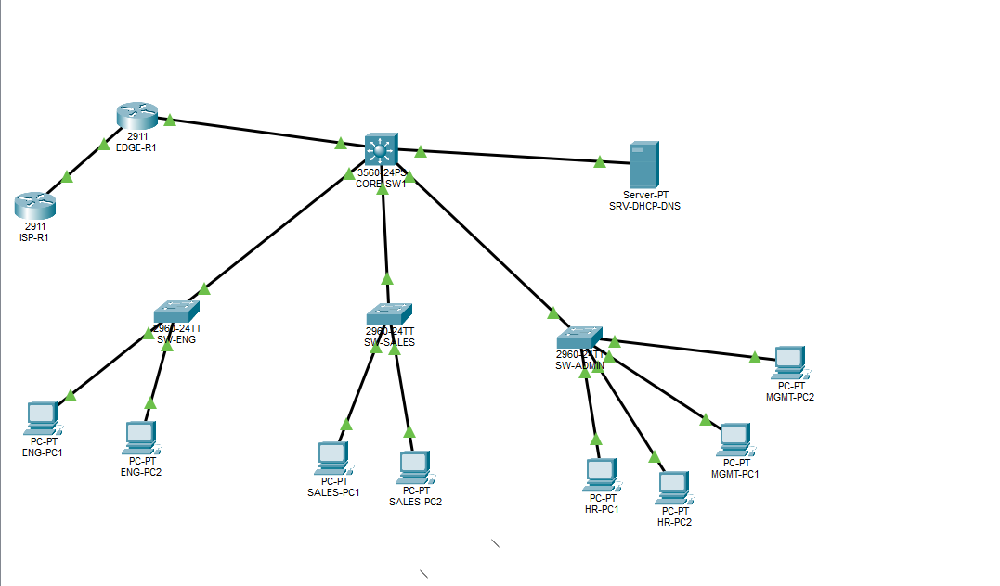

# Small Enterprise Network

A Cisco Packet Tracer project that simulates a small enterprise network using VLAN segmentation, VLSM subnetting, inter-VLAN routing, centralized network services, access control, and NAT/PAT.

## Network Topology



## Project Overview

The goal of this project was to design, configure, and troubleshoot a functional enterprise-style network while applying core networking concepts in a hands-on environment.

The completed network includes:

- VLSM subnetting
- VLAN segmentation
- Access port configuration
- 802.1Q trunking
- Inter-VLAN routing
- DHCP
- DHCP relay
- DNS
- Extended ACLs
- Static and default routing
- NAT/PAT
- Simulated ISP connectivity
- Network troubleshooting and verification

## Network Design

A Cisco 3560 multilayer switch (`CORE-SW1`) provides Layer 3 routing between the internal VLANs.

Cisco 2960 access switches provide connectivity for the Engineering, Sales, HR, and Management departments.

A dedicated server VLAN hosts centralized DHCP and DNS services.

`EDGE-R1` connects the internal enterprise network to a simulated ISP and performs NAT/PAT for internal clients.

## VLAN and IP Addressing

| VLAN | Department | Network | Default Gateway |
|---|---|---|---|
| 10 | Engineering | 10.10.0.0/25 | 10.10.0.1 |
| 20 | Sales | 10.10.0.128/26 | 10.10.0.129 |
| 30 | HR | 10.10.0.192/27 | 10.10.0.193 |
| 40 | Management | 10.10.0.224/28 | 10.10.0.225 |
| 50 | Servers | 10.10.0.240/28 | 10.10.0.241 |

## Network Services

### DHCP

A centralized DHCP server (`10.10.0.242`) provides dynamic IPv4 addressing to client VLANs.

Because the DHCP server resides in VLAN 50, DHCP relay was configured on the client VLAN SVIs using `ip helper-address`.

### DNS

The same server provides internal DNS services.

A DNS A record maps:

`server.company.local → 10.10.0.242`

Name resolution was successfully tested from client devices.

## Network Security

An extended ACL named `SALES-RESTRICTIONS` prevents devices in the Sales VLAN from accessing the HR VLAN while allowing other permitted traffic.

Testing confirmed that Sales-to-HR communication was blocked while access to other permitted networks remained functional.

## Edge Routing and NAT/PAT

`CORE-SW1` connects to `EDGE-R1` using the `10.10.1.0/30` point-to-point network.

`EDGE-R1` connects to the simulated ISP using `203.0.113.0/30`.

PAT overload allows multiple internal private IPv4 addresses to share the outside address `203.0.113.1`.

NAT translations were verified using Cisco IOS commands.

## Testing and Verification

The completed network was tested for:

- DHCP address assignment
- Default gateway connectivity
- Inter-VLAN routing
- DNS name resolution
- Server connectivity
- ACL enforcement
- Edge-router connectivity
- Simulated ISP connectivity
- NAT/PAT translation

All planned connectivity and security tests were successfully completed.

## Troubleshooting Experience

Several configuration issues were identified and resolved during the project, including:

- Incorrect physical interfaces used for trunk configuration
- Incorrect SVI addressing
- Incorrect endpoint IP addressing
- DHCP relay requirements across VLAN boundaries
- ACL placement and direction during Packet Tracer testing

Troubleshooting was performed using connectivity tests and Cisco IOS verification commands.

## Repository Structure

```text
Small-enterprise-network/
├── documentation/
│   ├── ip-addressing.md
│   └── network-configuration.md
├── packet-tracer/
│   └── Small-Enterprise-Network.pkt
└── README.md
